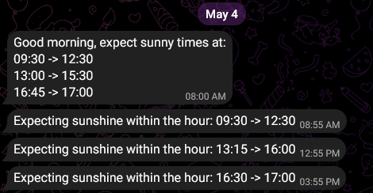

# Sunny Notification Bot

Telegram bot that notifies when it's sunny - https://t.me/SunnyNotificationBot


This bot is still in alpha, and you must be added to allow list in order to interact with it. Feel free to clone and run locally.

### User manual

As in every bot, start by sending the `/start` command.
Send command `/subscribe` to subscribe and then send location. The location must be in Germany, doesn't have to be exact, and unfortunately doesn't work from telegram web. The `/location` command is an alternative. Location can be updated at any time.
The bot sends daily forecast in the morning and update notification if it's sunny every hour.

#### Interactions

| Command             | Description                                                                                                          |
| ------------------- | -------------------------------------------------------------------------------------------------------------------- |
| `/start`            | Description                                                                                                          |
| `/help`             | List of commands                                                                                                     |
| `/subscribe`        | Subscribe to Sunny notification bot. This saves user preferences such as location                                    |
| `/forecast` or `/f` | Get today's forecast. Add number (ex .`/f 1`) to see tomorrow's forecast. Applicable numbers are -1 (yesterday) to 3 |
| `/location`         | Update location with latitude and longitude, separated by comma. Example `/location 52.521,13.295`.                  |

Sending location updates your preference.

### Run

```console
npm start
```

### Develop

#### First time setup

```console
git clone https://github.com/NoamRa/sunny-notification-bot.git
cd sunny-notification-bot
npm install
```

Fill `.env` file

```console
cp example.env .env
```

and add the bot's token from [BotFather](https://t.me/botfather) and allowed users

To develop use

```console
npm run dev
```

#### Steps to run attended

##### Using `rc.local`

- Add start:unattended command to `/etc/rc.local` or any startup script:
  ```sh
  cd /path/to/sunny-notification-bot
  npm run start:unattended &
  cd -
  ```
- If not working, check `/var/log/syslog`, or better yet
  `cat /var/log/syslog | grep -B 3 -A 3 sunny-notification-bot`
- If git throws with "detected dubious ownership in repository", run
  `sudo git config --global --add safe.directory /path/to/sunny-notification-bot`

##### Using pm2

- If not installed already, install [pm2](https://pm2.keymetrics.io) and set up autostart using `pm2 startup`
- Navigate to project root and register sunny-notification-bot with pm2:
  ```sh
  pm2 start ecosystem.config.cjs
  ```
- Save setup with `pm2 save`

#### Remote debugging

- Configure target on [chrome://inspect/#devices](chrome://inspect/#devices) to
  match server's IP address ex: `192.168.0.123:9229`.
- Use the `inspect` option with `0.0.0.0:9229` as host:
  ```sh
  node --inspect=0.0.0.0:9229 --max-old-space-size=abc ./src/main.js
  ```
- Server should appear as remote target. Click inspect to open Chrome DevTools.

### TODO

- [ ] Retry when `getWeather` fails (communicate failure to user after retries?)
- [ ] Users
  - [ ] Users can unsubscribe - completely deleting entry
  - [ ] User can choose wether to get morning notification: none / only when sunny / every morning
  - [ ] User can choose wether to get hourly notifications: yes / no
  - [x] User can set their location
